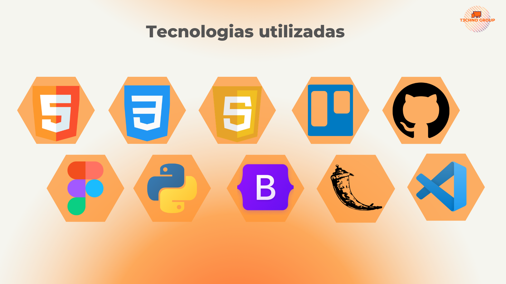

# Projeto-InFatec

```bash
git clone https://github.com/T3chnogroup/Projeto-InFatec.git
cd Projeto-InFatec
```

Criar ambiente virtual Python:
```bash
python3 -m venv env
```
Iniciar ambiente:

Para Windows:
```bash
.\env\Scripts\activate
```

Para Linux:
```bash
source env/bin/activate
```

Instalar dependencias:
```bash
pip3 install -r requirements.txt
```

Executar aplicação:
```bash
python3 wsgi.py
```