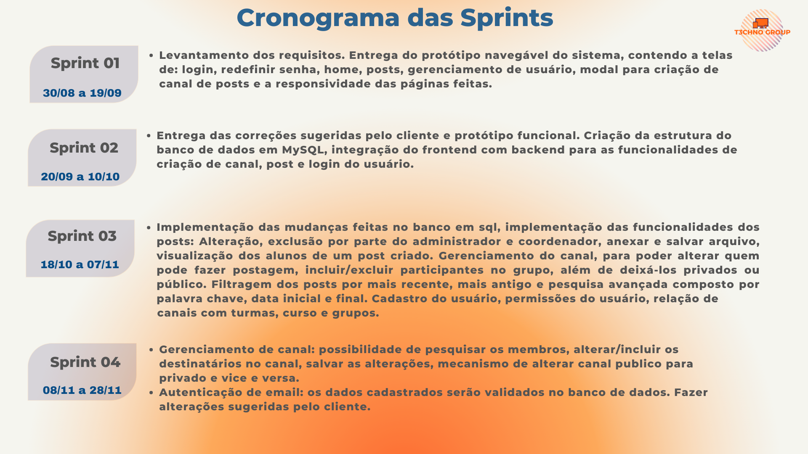
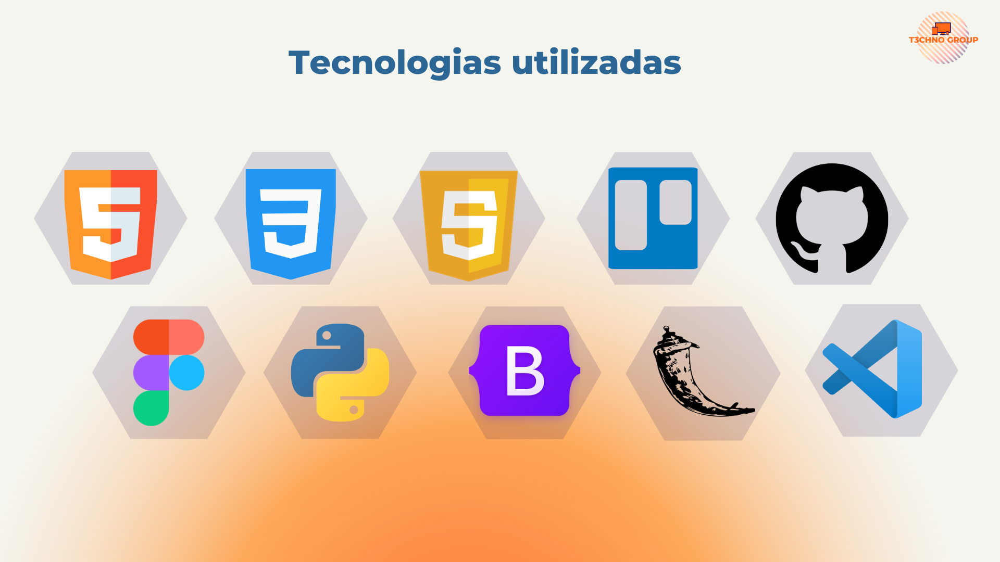

# Projeto-InFatec


## Dev Team

* Lucas Braz Dias (Product Owner)
#### [Linked](https://www.linkedin.com/in/lucas-braz-dias/) [Github](https://github.com/lucasbdias)


* Priscila Aparecida Silva (Scrum Master)
#### [Linked](https://www.linkedin.com/in/priscilasilva1801/) [Github](https://github.com/prsilva)


* Tais Gomes Salomao (Dev Team)
#### [Linked](https://www.linkedin.com/in/tais-salomao) [Github](https://github.com/taissalomao)


* Elen Fernanda dos Santos Petri (Dev Team)
#### [Linked](https://www.linkedin.com/in/elen-petri/) [Github](https://github.com/elenpetri)


* Rodrigo de Andrade Paula (Dev Team)
#### [Linked](https://www.linkedin.com/in/rodrigo-de-andrade-a34605104) [Github](https://github.com/RodrigodeAndrade90)


* Kevin Ferreira Mirenda (Dev team)
#### [Linked](https://www.linkedin.com/in/kevin-mirenda-a54a64220) [Github](https://github.com/KevinFMfatec)


## API 1º Semestre do Curso de Desenvolvimento de Software Multiplataforma

* M2: Prof. Gerson da Penha Neto
* P2: Prof. Fabricio Galende M Carvalho


## Objetivo do Projeto
O objetivo do projeto se baseou no problema que começou devido a pandemia do novo Coronavirus. O volume de informações da parte administrativa trocadas com os alunos e professores através do e-mail vieram tendo um aumento significativo fazendo com que muitas informações importantes passassem a ser lidas fora do seu tempo apropriado, ou seja, perda informações importantes. Para solucionar esse problema decidimos criar uma aplicação web onde os docentes e discentes possam ver as informações de forma seletiva e controlada, sendo eles avisos gerais ou específicos dos cursos.


## *User Story*

| Quem | O que? | Para |
|:--------------:  | :----------:|:---------------------------------------------------------|
|    Administrador   | Quero poder adicionar os usuários que irão utilizar o meu sistema de acordo com a sua função (Administrador, Coordenador, Aluno), poder alterar alguma informação dele posteriormente e fazer a remoção do mesmo. | Gerenciar os usuários do sistema.|
|    Administrador e Coordenador   | Quero fazer o envio de informações com a possibilidade de anexar documentos para os discentes e docentes. | Divulgar as informações para os discentes e docentes. |
|    Docente e Discente   | Quero visualizar de forma seletiva e controlada os avisos gerais ou específicos dos cursos. | Visualizar as informações de modo seletivo.|
|    Docente e Discente   | Quero uma maneira para facilitar a achar as informações mais recentes ou antigas e até mesmo visualizar de acordo com uma data.| Visualizar as informações de modo seletivo.|
|    Docente e Discente   | Após ler alguma informação gostaria que ela não aparecesse mais para mim por não me interessar. | Visualizar as informações de modo seletivo.| 
|    Docente e Discente   | Quero ver as informações tanto no desktop quanto no celular. | Responsividade do site. |








## Passo a passo da instalação do sistema

```bash
git clone https://github.com/T3chnogroup/Projeto-InFatec.git
cd Projeto-InFatec/src
```

Criar ambiente virtual Python:
```bash
python3 -m venv env
```
Iniciar ambiente:

Para Windows:
```bash
.\env\Scripts\activate
```

Para Linux:
```bash
source env/bin/activate
```

Instalar dependencias:
```bash
pip3 install -r requirements.txt
```

Executar aplicação:
```bash
python3 wsgi.py
```
## Importar Banco de dados
Importar o Banco de dados que está no src/bd em sua máquina.

## Antes de rodar a aplicação, siga os passos abaixo:

Renomear arquivo .env.exemplo para .env

cp .env.exemplo .env

Alterar dados de acordo com seu ambiente:

```bash
MYSQL_Host = [host MySQL ou localhost]
```
```bash
MYSQL_USER = [nome usuário]
```

```bash
MMYSQL_PASSWORD = [senha banco de dados]
```
```bash
MYSQL_DB = infatec
```

## Sistema Desenvolvido 


## Cronograma de Entregas

| Data | Links |
| ------ | ------ |
|    19/09/2021    |[Sprint 1](https://github.com/T3chnogroup/Projeto-InFatec/releases/tag/Sprint-01)|
|    10/10/2021    |[Sprint 2](https://github.com/T3chnogroup/Projeto-InFatec/releases/tag/Sprint-02)|
